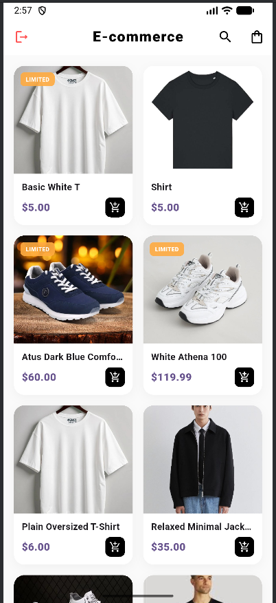
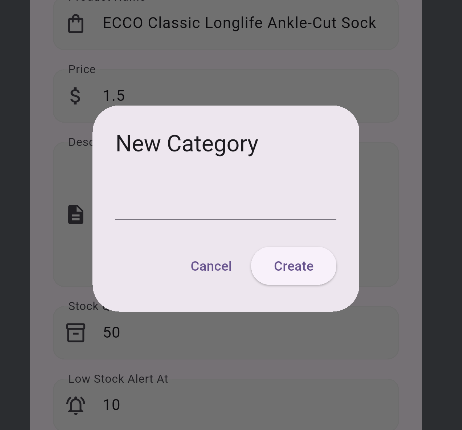
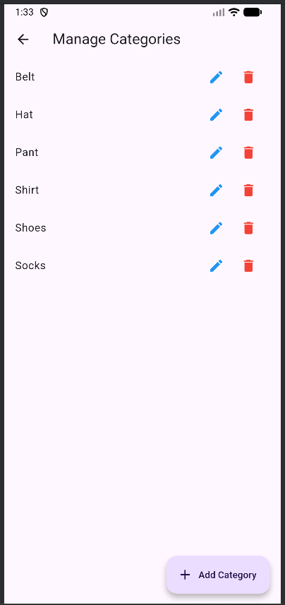
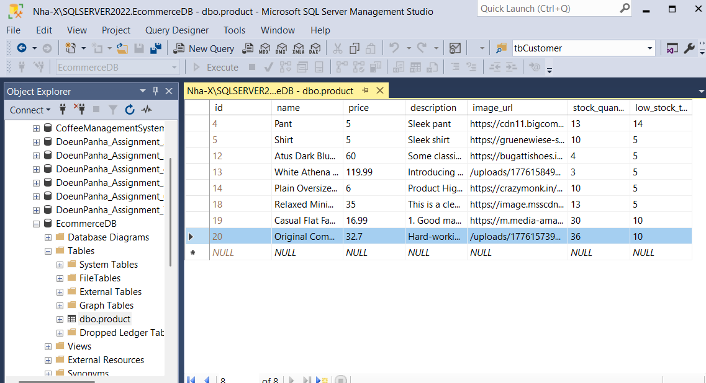
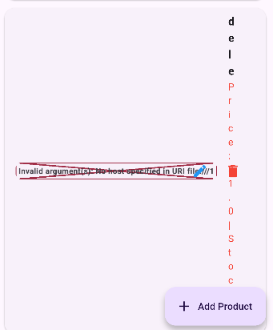
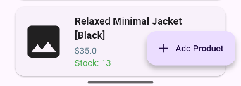
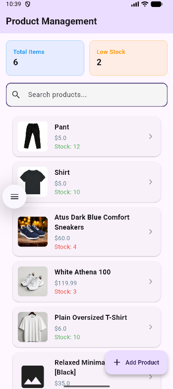
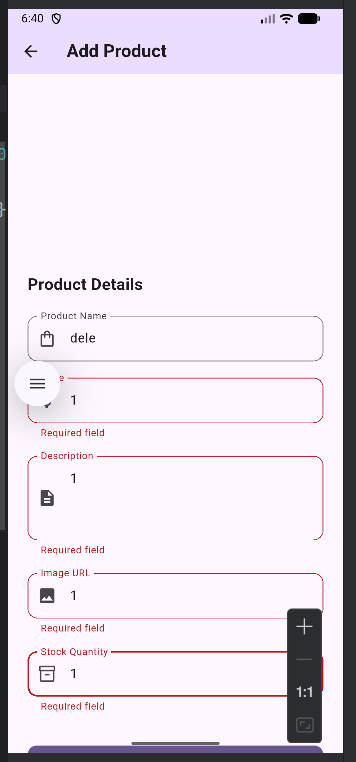
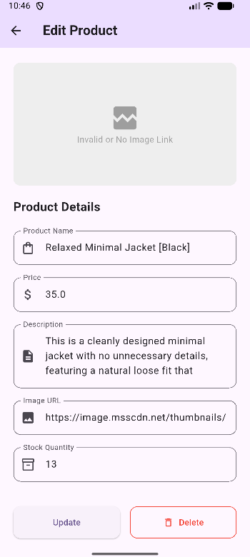

# Developer Log - Product Management Module

All notable changes to this project will be documented in this file.

## [2026-04-19] - Role-Based Access Control & User Storefront

### Added
- **User Storefront**: Implemented `UserStorefrontScreen` and `UserProductCard` to provide a dedicated customer-facing shopping interface.
- **JWT Role Decoding**: Integrated `jwt_decoder` to extract user roles (`ADMIN` vs `USER`) directly from the session token.
- **Role-Based Routing**: Updated `main.dart` to automatically redirect users to either the Admin Dashboard or the User Storefront based on their credentials.

### Changed
- **Modular Component Design**: Renamed legacy `ProductCard` to `AdminProductCard` to support a multi-role UI architecture.
- **Clean Architecture**: Refactored `ProductProvider` and `main.dart` to better handle session state and role-specific data fetching.

### Dependencies
- Added `jwt_decoder: ^2.0.1` for token payload analysis.

|                         Outcomes                          |
|:---------------------------------------------------------:|
|  |

## [2026-04-18] - Auth Flow & Error Handling Improvements

### Fixed

- **Backend Error Parsing**: Resolved FormatUnexpected end of input in Flutter by implementing a GlobalExceptionHandler in Spring Boot to return JSON error bodies instead of raw stack traces.
- **Duplicate User Handling**: Cleaned up SnackBar messages; now explicitly displays "Username already exists" when a SQL UNIQUE constraint is triggered.
- **Password Validation**: Fixed synchronization issue where passwords occasionally showed "not match" despite being identical. Updated validator to pull live values from TextEditingController.
- **UI Compiler Error**: Resolved named parameter 'suffixIcon' isn't defined by updating the CustomTextField constructor.

### Added

- **GlobalExceptionHandler**: Centralized backend error handling for RuntimeException and DataIntegrityViolationException.
- **Dynamic Validation**: Added onChanged triggers to auth fields to provide instant visual feedback on password matching.
- **Password Toggle**: Integrated suffixIcon support in CustomTextField for visibility toggling.

## [1.2.0] - 2026-04-17

### 🏗️ Authentication & Full-Stack Security

- **JWT Implementation**: Integrated stateless authentication using io.jsonwebtoken (JJWT) on the backend and flutter_secure_storage on the mobile client.
- **Security Filter Chain**: Implemented JwtAuthenticationFilter in Spring Boot to intercept and validate Bearer tokens for all protected API routes.
- **Reactive Auth Guard**: Refactored main.dart using a Consumer<AuthProvider> pattern to automatically toggle the app root between LoginScreen and ProductListScreen based on real-time authentication state.
- **Authenticated Services**: Updated ProductApiService and CategoryApiService to globally inject the stored JWT into request headers.

### 📁 Static Resource & Image Resolution

- **Public Resource Mapping**: Corrected WebConfig to map the URL path /uploads/** to the physical uploads/ directory on the server.
- **Security Bypass**: Configured SecurityConfig and JwtAuthenticationFilter to explicitly ignore the /uploads/ path, resolving the 403 Forbidden error for static image rendering in the Flutter app.
- **Path Calibration**: Standardized file storage to the root uploads/ folder to ensure consistency between the Java ResourceHandler and the physical file system.

### 🛠️ UI/UX & Navigation

- **Logout Flow**: Added a logout action to the ProductInventory AppBar with a confirmation dialog and automated state cleanup.
- **Resilient Layout**: Fixed placeholder layout in ProductFormScreen using double.infinity width to ensure the "Invalid Image" box fills the column width.
- **Native Build Stability**: Migrated android/app/build.gradle.kts to proper Kotlin DSL syntax, resolving minSdkVersion and jvmTarget deprecation errors.

### 🛠 Fixes & Improvements

- **Resolved 403 Forbidden**: Fixed the issue where valid data was fetched but images failed to display due to Spring Security blocking unauthenticated GET requests to the uploads folder.
- **Kotlin DSL Migration**: Fixed build failures caused by incorrect space-separated tokens in the Gradle configuration.

## [2026-04-15] - Architectural Overhaul & Feature-Based Modularization

### 🏗️ Software Architecture
- **Feature-Based Modularization**: Restructured the project from a flat directory system to a professional, scalable architecture organized by business features (`lib/features/products` and `lib/features/categories`).
- **Core Layer Implementation**: Introduced `lib/core/` for shared logic, including centralized API constants, global theme definitions, and reusable utility validators.
- **Service Decoupling**: Split the generic `ApiService` into domain-specific services (`ProductApiService` and `CategoryApiService`) for better separation of concerns.

### 📁 File Migration & Refactor
- **Organized Models & Logic**: Moved `Product` and `Category` models, along with their respective `Providers`, into feature-specific directories.
- **Clean Presentation Layer**: Relocated screens and feature-specific widgets to their corresponding `presentation/` folders within the feature modules.
- **Legacy Cleanup**: Removed abandoned `lib/screens`, `lib/providers`, `lib/services`, and `lib/widgets` directories to finalize the transition.

### 🛠️ Cleanup & Sync
- **Centralized Navigation**: Updated `lib/main.dart` with new modular imports and verified route consistency.
- **Shared Widgets**: Migrated `ProductCard` and other reusable components to `lib/core/widgets/` for cross-feature availability.

## [1.1.0] - 2026-04-15

### Fixed
- **Backend**: Resolved `DataIntegrityViolationException` when deleting categories by implementing a "Set Null" strategy. Injected `ProductRepository` into `CategoryController` to decouple products before category removal.
- **Frontend**: Fixed Flutter assertion crash (Red Screen) in `ProductFormScreen` by adding existence validation for the `_selectedCategory` within the dropdown.

### Added
- **UI**: Implemented an inline **"+ Create New Category"** option within the product form dropdown for a more seamless user experience.
- **Management**: Added a comprehensive `CategoryListScreen` with full CRUD (Edit/Delete) functionality for categories.

### Changed
- **Sync**: Integrated `ProductProvider` synchronization logic to ensure the product list updates immediately after a category is modified or removed.
- **Refactor**: Rebuilt `ProductFormScreen` using a more robust `Consumer` pattern to handle real-time UI updates when category data changes.
- **Reliable**: Changed all the products' url to use user's uploaded image instead to ensure reliability when loading images.

|                                              Outcomes                                              |
|:--------------------------------------------------------------------------------------------------:|
| .png) |
|                         |
|                                          |

## [2026-04-14] - Product Categorization System

### 🏗️ Backend & Database
- **Relational Mapping**: Created Category entity and established a @ManyToOne relationship with Product.
- **Category API**: Implemented REST endpoints to fetch all categories and persist new ones.
- **SQL Server Update**: Migrated schema to include category_id foreign key in the Products table.

### 📱 Frontend & UI
- **Dynamic Dropdown**: Integrated DropdownButtonFormField with a hybrid selection model (choose existing vs. trigger new).
- **Categorization Dialog**: Developed an asynchronous AlertDialog to allow real-time category creation without losing form state.
- **State Integration**: Linked CategoryProvider to the product creation flow to ensure the dropdown always has the latest data.

## [2026-04-14] - Full-Stack Image Upload & Local Storage

### 🏗️ Backend & Database (Spring Boot / SQL Server)
- **Local File Storage**: Configured ProductController to save binary images to a dedicated user-photos/ directory on the server instead of relying on external URLs.
- **Static Resource Mapping**: Implemented WebConfig to map the web path /uploads/** to the physical storage folder, allowing the Flutter app to retrieve files via HTTP.
- **Repository Optimization**: Fixed Java Generics type error by migrating ProductRepository from primitive int to the Integer wrapper class.
- **Database Strategy**: Shifted storage logic to save relative file paths in SQL Server, significantly improving query performance and data portability.

### 📱 Frontend & Mobile (Flutter)
- ** Native Image Selection**: Integrated the image_picker plugin to allow selecting product photos from the Android gallery.
- **Multipart Data Handling**: Refactored ProductProvider and ApiService to use http.MultipartRequest, enabling simultaneous upload of product metadata and binary image files.
- **Dynamic Image Hosting**: Implemented a "Hybrid URL" logic in _buildImagePreview and ProductCard to gracefully handle both legacy web links (http://...) and new local server paths.
- **Native Configuration**: Configured AndroidManifest.xml with READ_EXTERNAL_STORAGE and READ_MEDIA_IMAGES permissions to support modern Android API levels.

### 🛠️ Fixes & Native Troubleshooting
- **Build Synchronization**: Resolved MissingPluginException by performing a full native "Cold Boot" (clean/rebuild) to register plugin channels.
- **Model Flexibility**: Updated the Product model to make imageUrl optional, preventing validation errors during the "Create" phase of new products.
- **Emulator Connectivity**: Configured the Flutter app to use the specialized 10.0.2.2 IP address to communicate with the Spring Boot server running on the host machine.

|                 Dynamic Image Storing                  |
|:------------------------------------------------------:|
|  |

## [2026-04-13] - Architecture Refactor & UI Polish

### 🏗️ Software Architecture
- **Layered Folder Structure**: Migrated from a monolithic file structure to a professional modular system (`models/`, `providers/`, `screens/`, `widgets/`, `utils/`).
- **State Management**: Optimized `ProductProvider` to manage asynchronous API lifecycle states (loading, success, error) for the Spring Boot backend.
- **Centralized Business Logic**: Implemented `AppValidators` utility to provide a single source of truth for URL, numeric, and required field validation.
- **Service Layer**: Decoupled API calls into a dedicated `ApiService` class using the `http` package.

### ✨ UI/UX & Component Design
- **Reusable Input Components**: Created `ProductInputField` widget to standardize form design and reduce code duplication.
- **Global Theming**: Centralized UI constants (border radius, input decorations) in `AppTheme` for application-wide consistency.
- **Responsive Layout**: Wrapped forms in `SingleChildScrollView` to resolve bottom-overflow issues during keyboard interaction.
- **Real-time Image Preview**: Implemented a dynamic preview window in the product form with graceful error handling for invalid URLs.

### 🛠️ Fixes & Small Tweaks
- **Keyboard Optimization**: Set `isNumber: true` for price and stock fields to automatically trigger the numeric keypad.
- **Safety Dialogs**: Added an asynchronous confirmation dialog for the "Delete Product" action.
- **Search Logic**: Integrated a local search filter in `ProductListScreen` using a `TextEditingController` listener.

## [2026-04-13] - UI/UX & Validation Fixes

### 🛠 Fixes & Improvements
- **Resolved Overflow Issues**: Wrapped the `ProductFormScreen` in a `SingleChildScrollView` to prevent "Bottom Overflow" errors when the keyboard is active.
- **Enhanced URL Validation**: Added a helper function to validate Image URLs before attempting to render them, preventing app crashes on invalid input.
- **Improved List Layout**: Refactored `ProductListScreen` to use `Row` and `Expanded` widgets, fixing a bug where text was compressed vertically.
- **Cleaned up Actions**: Moved Edit and Delete functions from the main list into the `ProductFormScreen` for a cleaner interface.
- **Added Safety Nets**: Implemented a `_confirmDelete` dialog to prevent accidental data loss.

### 📸 Screenshots
|                     Before Fix (Overflow/Layout)                     |           After Fix (Clean & Scrollable)            |
|:--------------------------------------------------------------------:|:---------------------------------------------------:|
|  |            |
|                                                    |  |
|                                            |                          |